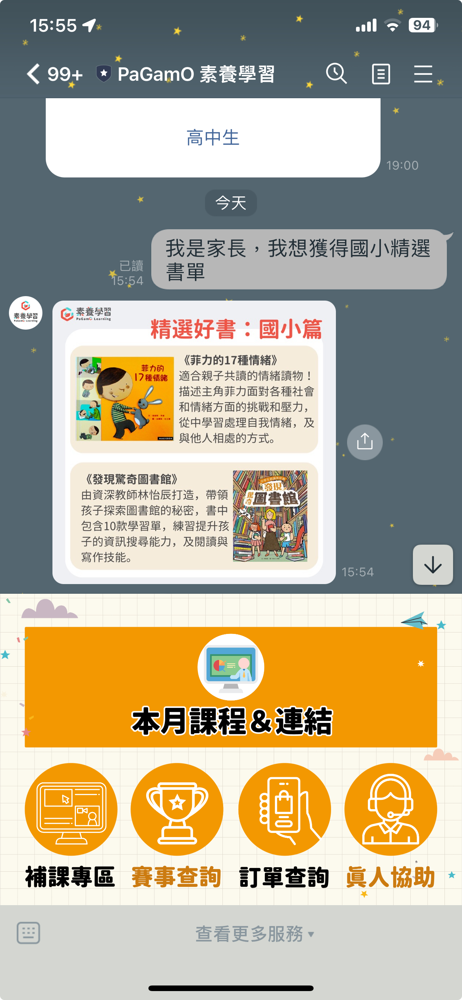

# LINE OA 概覽

<figure><figcaption></figcaption></figure>

LINE OA 共分為 2 大區塊：**對話框**、**圖文功能選單**

**對話框**

對話框主要為素養商品作答狀況的學習進度提示處 e.g. 學習表現通知、月評量任務通知。另外，LINE OA 也會不定時發送活動推廣、書單推薦等不同訊息。

用戶也可以於指定的真人客服服務時間於對話框中詢問 PaGamO 或是素養商品相關資訊的問題。

**圖文功能選單**

圖文功能選單的主要功能包括

1. 取得閱讀理解課上課連結的**本月課程與連結**
2. 取得閱讀理解課錄影影片的**補課專區**
3. 取得 PaGamO 電競賽資訊的**賽事查詢**
4. 查詢素養商品訂單（進入家長後台訂單功能）的**訂單查詢**
5. 取得客服聯絡資訊的**真人協助**
